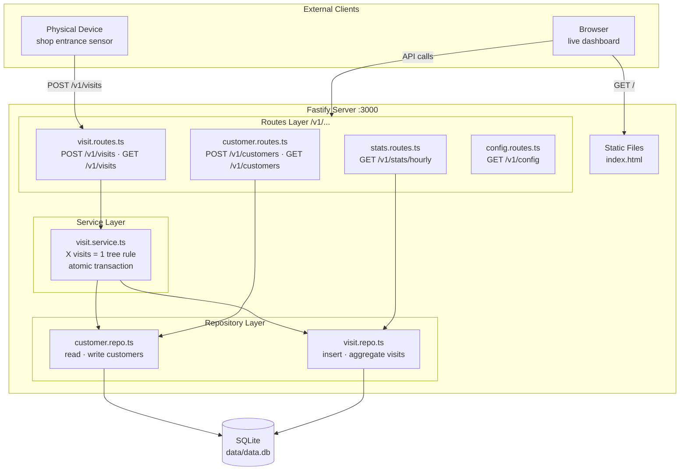
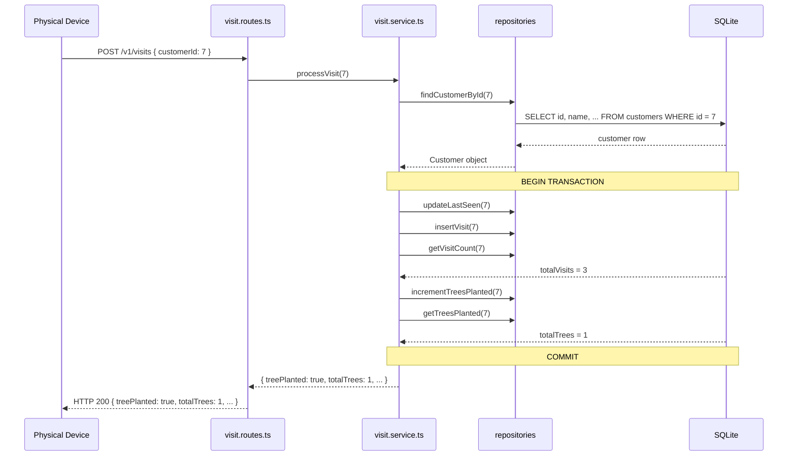
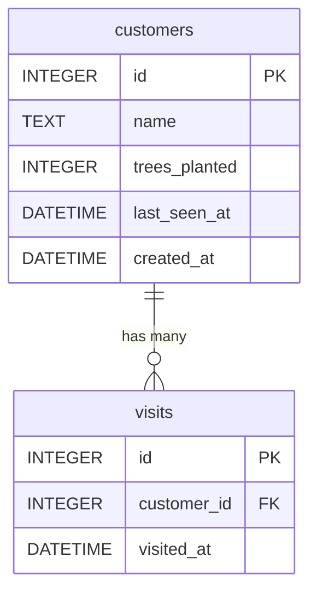

# Tree Nation — X Visits = 1 Tree

A backend service that tracks customer shop visits and plants a virtual tree every X visits. Includes a live dashboard frontend.

---

## How It Works

A physical device at the shop entrance detects when a customer walks in and sends an HTTP event to this service. The service:

1. Records the visit and updates the customer's last-seen timestamp
2. Counts the customer's total visits
3. Every **X visits** (configurable), increments their tree counter
4. Exposes a dashboard showing live stats, a customer leaderboard, and a visit log

---

## Architecture

### System Overview



### Visit Event Flow

What happens inside the server on every `POST /v1/visits`:



### Database Schema



---

## Quick Start (Docker — recommended)

The fastest way to run the project. No Node.js installation required.

```bash
docker compose up --build
```

Then open **http://localhost:3000** in your browser.

To change the visits-per-tree threshold:

```bash
VISITS_PER_TREE=5 docker compose up --build
```

---

## Manual Setup (without Docker)

**Requirements:** Node.js 20+

```bash
# 1. Install dependencies
npm install

# 2. Start the development server (auto-restarts on file changes)
npm run dev
```

Then open **http://localhost:3000**.

**To run the production build:**

```bash
npm run build   # compiles TypeScript → dist/
npm start       # runs the compiled output
```

---

## Running Tests

```bash
npm test
```

Tests use an in-memory SQLite database — no file is created, nothing persists between runs. Each test gets a completely fresh database via `setDb()` injecting a new `:memory:` instance before every test. The real Fastify app is built with `buildApp()` and requests are fired using `.inject()` — no server port is opened.

---

## Test Cases

19 integration tests across 6 suites. Every suite spins up the full app stack against an isolated in-memory database.

---

### `POST /v1/customers` — 3 tests

| Test | What it verifies |
|---|---|
| Creates a customer and returns 201 with full customer shape | Response has status 201 and returns all 6 fields: `id`, `name`, `totalVisits: 0`, `treesPlanted: 0`, `lastSeenAt: null`, `createdAt` |
| Rejects an empty name with 400 | Schema validation blocks `name: ""` before the handler runs — returns standard error shape |
| Rejects a missing name with 400 | Schema validation blocks a body with no `name` field — returns standard error shape |

---

### `GET /v1/customers` — 2 tests

| Test | What it verifies |
|---|---|
| Returns an empty array when no customers exist | Fresh database returns `[]`, not null or an error |
| Returns all created customers with consistent shape | Every item in the array contains all 6 customer fields — confirms the unified shape is enforced at the list level too |

---

### `GET /v1/customers/:id` — 2 tests

| Test | What it verifies |
|---|---|
| Returns the customer with full shape including `createdAt` | Single customer lookup returns all 6 fields including `createdAt` (which was previously missing from this endpoint) |
| Returns 404 with standard error shape for unknown customer | Unknown ID returns `{ statusCode: 404, error: "Not Found", message: "Customer not found" }` — confirms the global error handler is normalizing errors |

---

### `POST /v1/visits` — 6 tests

This is the most important suite — it covers the core business rule.

| Test | What it verifies |
|---|---|
| Returns 404 with standard error shape when customer does not exist | Sending a visit for a non-existent customer throws from the service layer and returns the correct error shape |
| Records a visit and returns correct totals without `success` field | First visit returns `totalVisits: 1`, `treePlanted: false`, and confirms the removed `success` field is absent |
| Rejects a missing `customerId` with 400 | Schema validation blocks an empty body |
| Does not plant a tree before the threshold is reached | Visits 1 and 2 both return `treePlanted: false` when threshold is 3 |
| Plants exactly one tree at the configured threshold (3 visits) | The 3rd visit returns `treePlanted: true`, `totalTrees: 1`, `totalVisits: 3` — the core X visits = 1 tree rule |
| Plants a second tree after 2× the threshold | The 6th visit returns `treePlanted: true`, `totalTrees: 2` — confirms the rule repeats correctly |
| Tracks visits independently per customer | Alice reaching 3 visits does not affect Bob's counter — customer isolation is enforced |

---

### `GET /v1/visits` — 3 tests

| Test | What it verifies |
|---|---|
| Returns an empty array when no visits exist | Fresh database returns `[]` |
| Returns visits with customer name attached | Response includes `customerName` from the JOIN — not just the raw `customer_id` |
| Returns visits in descending order | Most recent visit (`highest id`) comes first — the `ORDER BY visited_at DESC, id DESC` sort is correct |

---

### `GET /v1/stats/hourly` — 2 tests

| Test | What it verifies |
|---|---|
| Returns an empty array when no visits exist | Fresh database returns `[]` |
| Aggregates visits by hour | Two visits in the same hour produce one row with `visits: 2` — the `GROUP BY` aggregation is working |

---

## API Reference

Base URL: `http://localhost:3000/v1`

Interactive documentation is available at **http://localhost:3000/docs** (Swagger UI).

All error responses share a consistent shape:
```json
{ "statusCode": 404, "error": "Not Found", "message": "Customer not found" }
```

---

### Customers

#### `POST /v1/customers`
Create a new customer.

**Request body:**
```json
{ "name": "Alice" }
```

**Response `201`:**
```json
{
  "id": 1,
  "name": "Alice",
  "totalVisits": 0,
  "treesPlanted": 0,
  "lastSeenAt": null,
  "createdAt": "2024-04-13T10:00:00.000Z"
}
```

---

#### `GET /v1/customers`
List all customers with their visit counts and trees planted.

**Response `200`:**
```json
[
  {
    "id": 1,
    "name": "Alice",
    "totalVisits": 9,
    "treesPlanted": 3,
    "lastSeenAt": "2024-04-13T14:00:00.000Z",
    "createdAt": "2024-04-13T10:00:00.000Z"
  }
]
```

---

#### `GET /v1/customers/:id`
Get a single customer by ID.

**Response `200`:** Same shape as a single item from `GET /v1/customers`.

**Response `404`:**
```json
{ "statusCode": 404, "error": "Not Found", "message": "Customer not found" }
```

---

### Visits

#### `POST /v1/visits`
Record a shop visit for a customer. This is the endpoint the physical device calls.

**Request body:**
```json
{ "customerId": 1 }
```

**Response `200`:**
```json
{
  "treePlanted": true,
  "totalVisits": 3,
  "totalTrees": 1,
  "visitsUntilNextTree": 3
}
```

**Response `404`:**
```json
{ "statusCode": 404, "error": "Not Found", "message": "Customer not found" }
```

---

#### `GET /v1/visits`
List the most recent visits with customer names.

**Query params:** `?limit=50` (default: 50, max: 200)

**Response `200`:**
```json
[
  {
    "id": 42,
    "customerId": 1,
    "customerName": "Alice",
    "visitedAt": "2024-04-13T14:00:00.000Z"
  }
]
```

---

### Stats

#### `GET /v1/stats/hourly`
Returns visit counts aggregated by hour, newest first.

**Response `200`:**
```json
[
  { "hour": "2024-04-13 14:00", "visits": 12 },
  { "hour": "2024-04-13 13:00", "visits": 7 }
]
```

---

### Config

#### `GET /v1/config`
Returns the current runtime configuration.

**Response `200`:**
```json
{ "visitsPerTree": 3 }
```

---

## Configuration

All settings are controlled via environment variables. Invalid values cause the server to crash on startup with a clear error message.

| Variable          | Default | Description                              |
|-------------------|---------|------------------------------------------|
| `PORT`            | `3000`  | Port the server listens on               |
| `VISITS_PER_TREE` | `3`     | How many visits before a tree is planted (must be a positive integer) |

Example:
```bash
PORT=8080 VISITS_PER_TREE=5 npm run dev
```

---

## Project Structure

```
src/
├── config/
│   └── env.ts              # Environment variable parsing and validation
├── db/
│   ├── database.ts         # SQLite connection, withTransaction helper
│   └── migrations.ts       # Table definitions (runs on startup)
├── frontend/
│   └── index.html          # Single-page dashboard (HTML + CSS + JS)
├── plugins/
│   └── swagger.ts          # Swagger / OpenAPI documentation setup
├── repositories/           # The only layer that writes SQL
│   ├── customer.repo.ts
│   └── visit.repo.ts
├── routes/                 # HTTP endpoint definitions (thin — no business logic)
│   ├── config.routes.ts
│   ├── customer.routes.ts
│   ├── stats.routes.ts
│   └── visit.routes.ts
├── schemas/                # Request and response shape definitions
│   ├── customer.schema.ts
│   ├── error.schema.ts
│   └── visit.schema.ts
├── services/
│   └── visit.service.ts    # Business logic: X visits = 1 tree, transaction handling
├── tests/
│   └── app.test.ts         # 19 integration tests (in-memory DB, no server started)
├── app.ts                  # Builds the Fastify app (shared by server and tests)
└── server.ts               # Entry point — calls buildApp() then listens on a port
```

Each layer has one job. Routes handle HTTP. Services handle business rules. Repositories handle SQL. Nothing crosses those boundaries. See the [Architecture](#architecture) diagrams above for the full picture.

---

## Assumptions

- **Customer identity is pre-known.** The physical device sends a `customerId` that already exists in the system. Customer registration is a separate flow handled via `POST /v1/customers`.
- **Visit = entry only.** The device fires one event when the customer walks in. There is no check-out concept — duration is not tracked.
- **One shop.** The system is designed for a single shop. Multi-location support would require adding a `shopId` to visits.
- **Visits are always legitimate.** No deduplication is applied (e.g. a customer who walks in and out twice in a minute gets two visits). The physical device is assumed to handle this logic.
- **SQLite is sufficient.** For a single-shop deployment with low concurrent traffic, SQLite with WAL mode provides adequate performance. A migration to PostgreSQL would be needed for multi-server deployments.

---

## Technical Decisions

| Decision | Rationale |
|---|---|
| **Fastify** over Express | Faster, built-in JSON Schema validation, native TypeScript support, Swagger integration with zero extra work |
| **SQLite** over PostgreSQL | Zero infrastructure setup, embedded in the process, sufficient for the scale described, WAL mode handles concurrent reads |
| **better-sqlite3** over node-sqlite3 | Synchronous API is simpler and faster for single-writer SQLite use cases |
| **Repository pattern** | All SQL is isolated in `repositories/`. Swapping the database only requires changing those files |
| **`withTransaction` helper** | The service layer runs atomic operations without importing the raw database — keeps business logic clean |
| **Transactions in visit processing** | Recording a visit and planting a tree are one atomic operation — if the server crashes mid-way, the data stays consistent |
| **`app.ts` / `server.ts` split** | `buildApp()` constructs the server without starting it, allowing tests to use `.inject()` without opening a real port |
| **Vanilla JS frontend** | The spec asks for "a simple frontend" — no framework overhead, no build step, zero dependencies |
